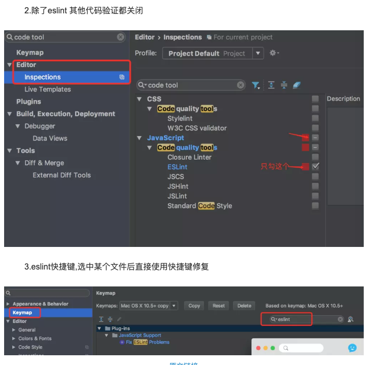
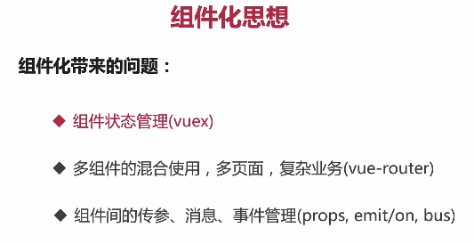
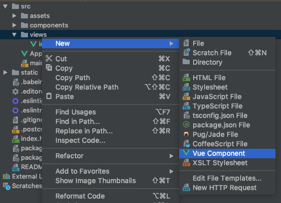
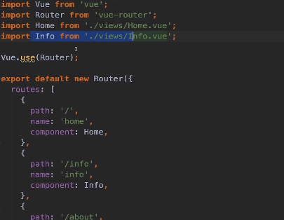
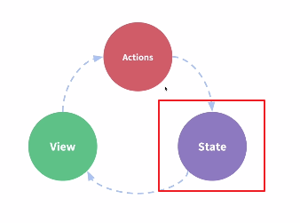
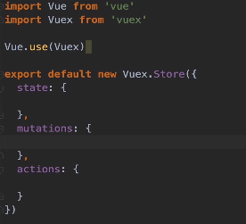
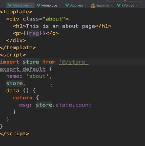
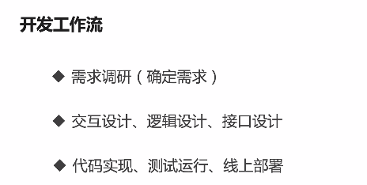

# Vue进阶一

### 快捷键

快速修复eslint格式错误



```
Ctrl+L
```

### —save和--save-dev

`npm install--save`另一个是`npm install –save-dev`，他们表面上的区别是`--save` 会把依赖包名称添加到 `package.json`文件 `dependencies`键下，`--save-dev`则添加到`package.json` 文件`devDependencies` 键下


它们真正的区别是，`npm`自己的文档说`dependencies`是**运行时依赖**，`devDependencies`是**开发时的依赖**。即devDependencies 下列出的模块，是我们开发时用的，比如 我们安装 js的压缩包gulp-uglify 时，我们采用的是 “npm install –save-dev gulp-uglify ”命令安装，因为我们在**发布后用不到它**，而只是在我们**开发才用**到它。dependencies 下的模块，则是我们发布后还需要依赖的模块，譬如像jQuery库或者Angular框架类似的，我们在开发完后后肯定还要依赖它们，否则就运行不了。

另外需要补充的是：
 正常使用`npm install`时，会下载`dependencies`和`devDependencies`中的模块，当使用`npm install –production`或者注明`NODE_ENV`变量值为`production`时，只会下载`dependencies`中的模块。


卸载包

```

npm uninstall <package-name>
删除模块包，对应模块包的信息不会从项目package.json文件中删除；

npm uninstall <package-name> --save
删除模块包，并且将对应的模块包信息从项目package.json的dependencies对象中删除；

npm uninstall <package-name> --save-dev
删除模块包，并且将对应的模块包信息从项目package.json的devDependencies对象中删除

```


### Cli脚手架

开发大型项目初始化工程的步骤

```
创建一个基于webpack模版的新项目（进到一个目录下）：

    vue init webpack my-project		或 vue create hellow-world   或 vue ui

安装依赖

    cd my-project

    npm run dev				或npm run start


```


#### 注意vue 3.x

```
Vue CLI 的包名称由 vue-cli 改成了 @vue/cli。 如果你已经全局安装了旧版本的 vue-cli (1.x 或 2.x)，你需要先通过 npm uninstall vue-cli -g 或 yarn global remove vue-cli 卸载它。


Node 版本要求
Vue CLI 需要 Node.js 8.9 或更高版本 (推荐 8.11.0+)

安装
npm install -g @vue/cli
# OR
yarn global add @vue/cli

检测是否正确
vue --version

创建项目
vue create test-project
```


整个项目我们只需要关心src目录

| 目录/文件    | 说明                                                         |
| :----------- | :----------------------------------------------------------- |
| build        | 项目构建(webpack)相关代码                                    |
| config       | 配置目录，包括端口号等。我们初学可以使用默认的。             |
| node_modules | npm 加载的项目依赖模块                                       |
| ==src==      | 这里是我们要开发的目录，基本上要做的事情都在这个目录里。里面包含了几个目录及文件：==assets==: 放置一些图片，如logo等。==components==: 目录里面放了一个组件文件，可以不用。==App.vue==: 项目入口文件，我们也可以直接将组件写这里，而不使用 components 目录。==main.js==: 项目的核心文件。 |
| static       | 静态资源目录，如图片、字体等。                               |
| test         | 初始测试目录，可删除                                         |
| .xxxx文件    | 这些是一些配置文件，包括语法配置，git配置等。                |
| index.html   | 首页入口文件，你可以添加一些 meta 信息或统计代码啥的。       |
| package.json | 项目配置文件。                                               |
| README.md    | 项目的说明文档，markdown 格式                                |


#### 单文件组件



如何新建组件




template、script、style

标准的App.vue

```html
<template>
  
  
  
  <div id="app">
    
    <HelloWorld/>
  </div>
  
  
  
</template>


<script>
import HelloWorld from './components/HelloWorld'

export default {
  name: 'App',
  components: {
    HelloWorld
  }
}
</script>


<style>
#app {
  font-family: 'Avenir', Helvetica, Arial, sans-serif;
  -webkit-font-smoothing: antialiased;
  -moz-osx-font-smoothing: grayscale;
  text-align: center;
  color: #2c3e50;
  margin-top: 60px;
}
</style>
```


```html
<template>
  <div class="hello">
    <h1>{{ msg }}</h1>
    <h2>Essential Links</h2>
  </div>
</template>

<script>
export default {
  name: 'HelloWorld',
  data () {
    return {
      msg: 'Welcome to Your Vue.js App'
    }
  }
}
</script>

<!-- Add "scoped" attribute to limit CSS to this component only -->
<style scoped>
h1, h2 {
  font-weight: normal;
}
ul {
  list-style-type: none;
  padding: 0;
}
li {
  display: inline-block;
  margin: 0 10px;
}
a {
  color: #42b983;
}
</style>
```


#### 区别

原来是对象的形式

```
data:{}
```

现在是函数形式

```html
data:function(){
	return 1
}

data(){
	return {
		myMsg:'',
		number:123,
}
}
```


原来是全局组件，这次单文件组件都是local的组件


#### 全局样式和局部样式

scoped表示局部样式

```
<style scoped>

</style>
```


### router路由

就是页面跳转、相对路径

分为定义和使用：

1、定义 在router.js中，有path、name，component（后面跟import进来的变量名）

1.1前提 注册一个vue的component

1.2 配置router.js文件




1.3使用，使用下列标签

```html
  <router-link to="/">Home</router-link>
```


### vuex

原来tm的是用于消息传递的

```
npm install vuex --save-dev
npm install -save moduleName 命令


建立store文件夹
在store文件夹中建一个文件 store.js
(其实完全可以在最外面建立一个store.js)


在项目main.js文件中引入store
import store from  './store/store'


最后在vue下注册
new Vue({
  el: '#app',
  router,
  store,
  template: '<App/>',
  components: { App }
})
```




状态驱动，用户改变页面就要进行行为的处理

vuex用于状态的集中管理




使用




#### 步骤

```html
Vue.use(Vuex)Vue.use(Vuex)

在store中引入Vuex
Vue.use(Vuex)
export default new Vuex.Store({
	state:{},
	mutations:{
	
	},
	actions:{
	
	}
})


重点编写state和mutations

最后在html页引入store
import store from "@/store.js"

在方法中使用
store.commit("123")

```


### 调试

#### 1、debugger	console.log


#### 2、vue的Chrome插件


#### 3、给vue一个变量

在浏览器中app.msg的方式调试


### 集成Vue




### 其它方法

```
新建vue组件

vue serve demo.vue
即可在网页调试
```


### 如何copy别人的前端

```
打开console栏
1、看头
用了哪些js库

2、看尾部
手写一些简单的js

3、看html结构
copy innerHTML

4、下载
打开source

```


其它小技巧

```
压缩css可以在console中格式化
```


### 清除node_modules

```
find . -name "node_modules" -print | xargs rm -rf
```


### sass scss

添加依赖

```
npm install --save-dev sass-loader
//sass-loader依赖于node-sass
npm install --save-dev node-sass
```


### webpack配置和部署


### qs

在main.js中

```
import qs from 'qs'
Vue.prototype.$qs = qs

```

使用

```
this.$qs.stringify({ aa:2, bb:3 })
```

stringify


### axios

https://www.kancloud.cn/yunye/axios/234845

封装使用axios

http://xbhong.top/2018/07/06/encapsulationOfAxiosInVue/


#### 简单配置和使用

引入axios包

```
npm install axios --save

或者淘宝的工具
cnpm install axios --save
```


main.js 中引入 axios

```
import axios from 'axios'
```


但在其它的组件中，是无法使用 axios 命令的。所以我们将 axios 改写为 Vue 的原型属性

```
Vue.prototype.$http= axios
```


就能直接在组件的 methods 中使用 $http命令，例如

```js
  methods: {
    show() {
      this.$http({
        method: 'get',
        url: 'api/user',
        data: {
          name: 'virus'
        }
     })
  }
```


#### restful不同的请求


对于get请求

```
    axios.get('/user', {
          params:{
                name:"virus"  
          }
    })
```

对于post请求

```
  axios.post('/user',{
      name:"virus" 
  })
```

一次性并发多个请求

```
function getUserAccount(){
  return axios.get('/user/12345');
}
function getUserPermissions(){
  return axios.get('/user/12345/permissions');
}
axios.all([getUserAccount(),getUserPermissions()])
  .then(axios.spread(function(acct,perms){
    //当这两个请求都完成的时候会触发这个函数，两个参数分别代表返回的结果
  }))
```


axios可以通过配置（config）来发送请求

```
//发送一个`POST`请求
axios({
    method:"POST",
    url:'/user/1111',
    data:{
      name:"virus" 
    }
});
```

完整的请求还应当包括 .then 和 .catch

```
   .then(function(res){
          console.log(res)
        })
    .catch(function(err){
          console.log(err)
        })
```

当请求成功时，会执行 .then，否则执行 .catch
 这两个回调函数都有各自独立的作用域，如果直接在里面访问 this，无法访问到 Vue 实例,这时只要添加一个 .bind(this) 就能解决这个问题。(如果你使用的是es6箭头函数就不存在这样的问题)

```
    .then(function(res){
          console.log(this.data)
     }.bind(this))
```


请求方式的别名，这里对所有已经支持的请求方式都提供了方便的别名

```
axios.request(config);

axios.get(url[,config]);

axios.delete(url[,config]);

axios.head(url[,config]);

axios.post(url[,data[,config]]);

axios.put(url[,data[,config]])

axios.patch(url[,data[,config]])
```


有时候我们在请求前需要对参数进行序列化

比如 Form Data

```
v Form Data					view source				view URL encoded
file: https://pic2.hanmaker.com/9f7f9c4b3f93447ed9.xmind
title: linux
```


```
function json2query(o) {
    let ret = [];
    for (let k in o) {
      ret.push(k + '=' + o[k]);
    }
    return ret.join('&');
  }
axios({
    method: 'post',
    url: `xxx`,
    data: {
      file:'abc.xmind',
      title:'xmind'
    },
    transformRequest: [(data) =>{      //在请求之前对data传参进行格式转换
      data = json2query(data)
      return data
    }],
    headers:{
      'Content-Type': 'application/x-www-form-urlencoded; charset=UTF-8'
    }
  })
```


在做开发的时候我们可能会遇到本地模拟数据的情况，这时候我们就要模拟本地数据了，下面就是vue开发请求本地模拟数据的配置方法

```
//对于新版本的webpack
//修改webpack.dev.conf.js
//首先
const express = require('express')
const app = express()
var data = require('../data.json')//加载本地数据文件
var apiRoutes = express.Router()
app.use('/api', apiRoutes）

//然后在devServer配置选项里面添加下面的代码
before(app){
  app.get("/api/seller",(req,res)=>{
    res.json({
      data:data.seller
    })
  })
}
```


#### @RequestParam对应的请求

https://blog.csdn.net/weixin_33750452/article/details/90798123


#### 跨域问题

在本地localhost访问接口[http://425.00.100.100:888/](http://425.0.100.100:8888/)是要跨域的，浏览器的安全策略，会报错，在webpack配置一下proxyTable就OK了，如下 config/index.js

```
dev: {
    加入以下
    proxyTable: {
      '/api': {
        target: 'http://425.0.100.100:8888/',//设置你调用的接口域名和端口号 别忘了加http
        changeOrigin: true,//如果需要跨域
        pathRewrite: {
          '^/api': '/'
                //这里理解成用面的地址，
                后面组件中我们掉接口时直接用api代替 比如我要调
                用'http://425.0.100.100:8888/user/add'，直接写‘/api/user/add’即可
        }
      }
    },
```


### js知识补充


```
使用var声明的变量，其作用域为该语句所在的函数内，且存在变量提升现象；
使用let声明的变量，其作用域为该语句所在的代码块内，不存在变量提升；
使用const声明的是常量，在后面出现的代码中不能再修改该常量的值。
```


给data中变量赋值报错：TypeError...undefined

```
console.log(response.data.data.token)
const token = response.data.data.token
this.tokenNew = token
```

原因 this指针变了，是上下文相关的

解决方法：

```
通过传参重新定义到this正确的位置上再赋值
使用箭头函数
存入localStorage(sessionstorage或者cookies也行)
```


### ElementUI


```
npm install element-ui --save


还有另外一种安装方式：
cnpm i element-ui -S
```

然后 打开项目：src/main.js,添加下面三条

```
import ElementUI from 'element-ui'
import 'element-ui/lib/theme-chalk/index.css'
Vue.use(ElementUI)
```


### 全局配置文件

https://blog.csdn.net/weixin_38362455/article/details/81588963

在`build`文件夹下`webpack.base.conf.js`可找到`@`


### github部署

在github上部署，那么你要修改config/index.js的以下代码, 不然有些文件因为路径问题可能会找不到。 build: {
    // Template for index.html
    index: path.resolve(__dirname, '../docs/index.html'),

    // Paths
    assetsRoot: path.resolve(__dirname, '../docs'),
    assetsSubDirectory: 'static',
    assetsPublicPath: '/vue-el-dashboard/',


### npm命令

https://www.npmjs.cn/


#### npm i与install

```
 
1. 用npm i安装的模块无法用npm uninstall删除，用npm uninstall i才卸载掉 
2. npm i会帮助检测与当前node版本最匹配的npm包版本号，并匹配出来相互依赖的npm包应该提升的版本号 
3. 部分npm包在当前node版本下无法使用，必须使用建议版本 
4. 安装报错时intall肯定会出现npm-debug.log 文件，npm i不一定

```


### 引入normalize.css

```
npm install --save normalize.css

如果报错则是缺少两个loader
npm install css-loader style-loader
```

然后配置i

```
webpack.config.js 中的 loaders 数组加入以下配置
{
test: /\.css$/,
loader: 'style!css'
}
```


引入

```
import NormailizeCss from 'normalize.css' 这个是为了复用其中某些部分，如果没必要直接：

import 'normalize.css'
```


### 引入图标

vue-awesome

```
import 'vue-awesome/icons'
import Icon from 'vue-awesome/components/Icon'

Vue.component('icon', Icon)
```


使用

```
 <icon name="beer"></icon>
```


### 全局组件配置

https://blog.csdn.net/yanzhi_2016/article/details/85339420


