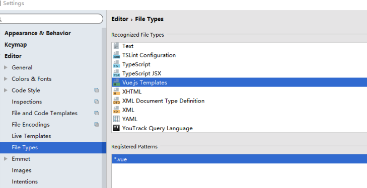
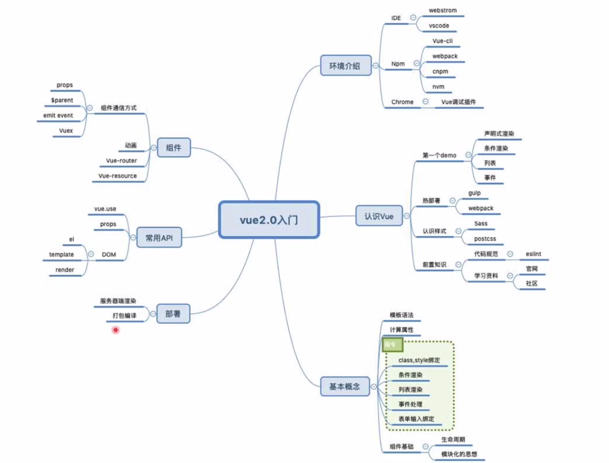

# Vue入门


### 常用命令

初始化工具命令

```
vue init webpack my-project
npm install package
npm run dev

npm run build 生成上线目录部署
```


结束命令：

```
Ctrl+c
或者kill node或者npm
```


### 前置条件

##### IDE

```
webstorm
```

##### chrome插件

```
vue.js devtools
```


##### npm

cli 

webpack 

nvm 

cnpm

```
npm -v
```

npm下载cli

```
npm i -g vue-cli
```


##### nvm

node版本管理工具 

安装：

```
下载到了：~/.nvm
curl -o- https://raw.githubusercontent.com/nvm-sh/nvm/v0.34.0/install.sh | bash

然后需要刷新一下
source ~/.bash_profile
```

安装vue

```
nvm install v11.0.0
```


### Cli脚手架

开发大型项目，用webpack打包，但webpack环境太复杂

```
进入终端（mac）,输入命名(安装vue-cli)：

    sudo npm install --global vue-cli

创建一个基于webpack模版的新项目（进到一个目录下）：

    vue init webpack my-project

安装依赖

    cd my-project

    npm run dev

接着就好了。

```


只有vue3.0才可以

```
vue create hello-world

vue ui

```


整个项目我们只需要关心src目录

| 目录/文件    | 说明                                                         |
| :----------- | :----------------------------------------------------------- |
| build        | 项目构建(webpack)相关代码                                    |
| config       | 配置目录，包括端口号等。我们初学可以使用默认的。             |
| node_modules | npm 加载的项目依赖模块                                       |
| ==src==      | 这里是我们要开发的目录，基本上要做的事情都在这个目录里。里面包含了几个目录及文件：==assets==: 放置一些图片，如logo等。==components==: 目录里面放了一个组件文件，可以不用。==App.vue==: 项目入口文件，我们也可以直接将组件写这里，而不使用 components 目录。==main.js==: 项目的核心文件。 |
| static       | 静态资源目录，如图片、字体等。                               |
| test         | 初始测试目录，可删除                                         |
| .xxxx文件    | 这些是一些配置文件，包括语法配置，git配置等。                |
| index.html   | 首页入口文件，你可以添加一些 meta 信息或统计代码啥的。       |
| package.json | 项目配置文件。                                               |
| README.md    | 项目的说明文档，markdown 格式                                |


### Webstorm新建vue模板

有时候是卡住了，等会就好





第二步


### 目录结构

| 目录/文件    | 说明                                                         |
| :----------- | :----------------------------------------------------------- |
| build        | 项目构建(webpack)相关代码                                    |
| config       | 配置目录，包括端口号等。我们初学可以使用默认的。             |
| node_modules | npm 加载的项目依赖模块                                       |
| src          | 这里是我们要开发的目录，基本上要做的事情都在这个目录里。里面包含了几个目录及文件：==assets==: 放置一些图片，如logo等。==components==: 目录里面放了一个组件文件，可以不用。==App.vue==: 项目入口文件，我们也可以直接将组件写这里，而不使用 components 目录。==main.js==: 项目的核心文件。 |
| static       | 静态资源目录，如图片、字体等。                               |
| test         | 初始测试目录，可删除                                         |
| .xxxx文件    | 这些是一些配置文件，包括语法配置，git配置等。                |
| index.html   | 首页入口文件，你可以添加一些 meta 信息或统计代码啥的。       |
| package.json | 项目配置文件。                                               |
| README.md    | 项目的说明文档，markdown 格式                                |


### 知识框架




### 入门


引入vue的方式

一、bootcdn

```
<script src="https://cdn.jsdelivr.net/npm/vue/dist/vue.js"></script>

或者打开
https://vuejs.org/js/vue.js
复制到vue.js中即可
```


二、工具 emmet

```
偏好中 plugin中搜索Emmet安装 重启，原来是Ctrl+E，现在是tab直接补全
```


### 绑定元素


也可以采用模板：

template里必须用标签结构化

```html
<!DOCTYPE html>
<html>
  <head>
    <meta charset="utf-8">
    <meta name="viewport" content="width=device-width,initial-scale=1.0">
    <title>test01</title>
<!--    <script src="https://cdn.jsdelivr.net/npm/vue/dist/vue.js"></script>-->
    <script src="Vue/vue.js"></script>
    <style>
      .myDiv{
        color: #abcdef;
      }
    </style>
  </head>
  <body>
    
    
    <div id="app"></div>
    
    
  </body>


  
  
  
  <script>
    new Vue({
      el:'#app',
      template:'<h3>Murasame {{ myMessage }}</h3>',
      data:{
        myMessage:'Hello Vue!!'
      }
    });
  </script>
  
</html>
```


### 指令

前面都一样不写了

#### v-on:	@

```html

  <body>

    <div id="app">
<!--      二者等价-->
      <h1>{{myMessage}}</h1>
      <h1 v-text="myMessage"></h1>

<!--      二者区别一目了然-->
      <h1 v-text="html"></h1>
      <h1 v-html="html"></h1>

<!--      绑定事件-->
      <h1 v-on:click="clickTest">click</h1>

    </div>


  </body>


  <script>
    new Vue({
      el:'#app',
      data:{
        myMessage:'Hello Vue!!',
        html:"<p>paragraph</p>",
      },
      methods:{
        clickTest:function(){
          this.myMessage = "New Message Mura!!"
        }
      },
    });
  </script>

```


#### v-bind:	:

属性绑定

指令后面跟的 不再是字符串而是 	js表达式

```html
<div id="app">

  <h1 title="title">ABC</h1>
  <h1 v-bind:title="title">ABC</h1>

</div>
    


<script>
  new Vue({
    el:'#app',
    data:{
      title:'This is my tile'
    },

  });
</script>
```

正常情况应该是

```html
<h1 v-bind:style="{'color':'red'}">ABC</h1>

或者提出去


<script>
  new Vue({
    el:'#app',
    
    data:{
      title:'This is my tile'，
      styleColor:{
      color:'red',
      textShadow:'0 0 5px #eee'
    }
    },
  });
</script>

<h1 v-bind:style="styleColor">ABC</h1>
```


#### v-model:

双向绑定

```html
 <body>
    <div id="app">
      <input v-model="msg" type="text">
      <h1 v-text="msg">ABC</h1>
    </div>
  </body>

  <script>
    new Vue({
      el:'#app',
      data:{
        msg:'This is MSG'
      },
    });
  </script>
```


#### Vue之computed

数据联系加工

计算属性，如果没有改变会利用缓存之，性能很高（==事件触发机制，且触发条件仅为vue内data变量==）

```html
<script>
    new Vue({
      el:'#app',
      data:{
        firstName:'',
        lastName:'',
      },
      computed:{
        fullName: function () {
          return this.firstName+' '+this.lastName
        }
      }
    });
  </script>


和data一样，里面是变量名字，只不过后面跟了函数
computed:{
        fullName: 
      }
```


#### Vue之watch

异步场景

监听事件的变化，利用上面案例，姓名变化就+1（新设的count变量就是为了显示变化）

其实直接watch fullName也是一样的效果

```html
  <body>

    <div id="app">

      姓：<input v-model="firstName" type="text">
      名：<input v-model="lastName" type="text">
      <h1 v-text="fullName"></h1>
      <h1 v-text="count"></h1>

    </div>


  </body>


  <script>
    new Vue({
      el:'#app',
      data:{
        firstName:'',
        lastName:'',
        count:0,
      },
      computed:{
        fullName: function () {
          return this.firstName+' '+this.lastName
        }
      },
      watch:{
        firstName: function () {
          this.count++//别忘了this
        },
        lastName: function () {
          this.count++
        }
      }
    });
  </script>
```


注意computed触发机制：必须是组件内部实例变量发生变化才触发


#### computed和watch的区别

不得不承认，很像，都是函数改变值

```
computed：多个依赖值运算时候，用这个

watch：一定要有新旧值
```


#### v-if v-show 

if是直接消失，show只是display为none

```html
  <body>

    <div id="app">

      <h1 v-if="toggleBoolean">Content</h1>
      <h1 v-show="toggleBoolean2">Content</h1>

      <button @click="handleToggle">ToggleButton</button>

    </div>


  </body>


  <script>
    new Vue({
      el:'#app',
      data:{
        toggleBoolean:true,
        toggleBoolean2:true,

      },
      methods:{
        handleToggle:function () {
          this.toggleBoolean =!this.toggleBoolean
          this.toggleBoolean2 =!this.toggleBoolean2

        }
      }
    });
  </script>
```


#### v-for

```html
 <body>

    <div id="app">

      <ul>
        <li v-for="(item,index) of myList" :key="index">{{item}}</li>
      </ul>

    </div>


  </body>


  <script>
    new Vue({
      el:'#app',
      data:{
        myList:[1,4,3,7,7,8],
      },

    });
  </script>
```


# 小应用todolist


```html
<!DOCTYPE html>
<html>
  <head>
    <meta charset="utf-8">
    <meta name="viewport" content="width=device-width,initial-scale=1.0">
    <title>test01</title>
    <script src="Vue/vue.js"></script>
    <style>
      .myDiv{
        color: #abcdef;
      }
    </style>
  </head>
  <body>

    <div id="app">

      <input v-model="myValue" type="text">
      <button @click="handleIt">Submit</button>
      <ul>
        <li v-for="(item,index) of myList" :key="index">{{item}}</li>
      </ul>

    </div>


  </body>


  <script>
    new Vue({
      el:'#app',
      data:{
        myValue:'',
        myList:[],

      },
      methods:{
        handleIt:function () {
          this.myList.push(this.myValue)
          this.myValue = ''
        }
      }

    });
  </script>
</html>

```


### todolist组件拆分


需求：li标签中的内容可能结构越来越复杂


先注册组件，有点像结构体，类

#### 组件失效问题

命名自动转换为小写


#### 局部组件

```html

<div id="app">
<ul>
<todo-localcomponent></todo-localcomponent>
</ul>
</div>


<script>
  // 局部组件
  var localComponent = {
    template: '<li>localItem</li>'
  }

  new Vue({
    el:'#app',
    components:{
      'todo-localcomponent':localComponent
    },
  });
</script>
```

 


#### 全局组件

一般比局部的好用

```html
 <body>
    <div id="app">
      <input v-model="myValue" type="text">
      <button @click="handleIt">Submit</button>

      <ul>
        <!--          mycontent后面的item就是循环中的item-->
        <todo-global-component
          v-for="(item,index) of myList"
          :key="index"
          :mycontent="item">

        </todo-global-component>
      </ul>
    </div>
  </body>

  <script>

   // props用于接收外部传入该组件的参数（往往是组件的属性名 变量），然后把该变量的值取出来就行了
    Vue.component(
      'todo-global-component',{
        props:['mycontent'],
        template:'<li>{{mycontent}}</li>'
      }
    )

    new Vue({
      el:'#app',

      data:{
        myValue:'',
        myList:[],

      },
      methods:{
        handleIt:function () {
          this.myList.push(this.myValue)
          this.myValue = ''
        }
      }

    });
  </script>
```


#### 组件和实例的关系

组件就是实例

```js
Vue.component(
      'todo-global-component',{
        props:['mycontent'],
        template:'<li>{{mycontent}}</li>',
        data:{
        	data1:'',
        	data2:123,
        },
        methods:{
        	handleOne:function(){
        		alert(111)
        	},
        	handleTwo:function(){
        		alert(222)
        	}
        }
      }
    )
```

实例中如果没有定义template，就把挂载点下所有的结构，作为template


#### 增加删除功能

其实是 子组件向父组件通信——发布订阅模式（前面父组件向子组件通信，是通过属性传值）


子组件要发布

@click="handleClick"自定义了一个发布器，发布给了父组件的订阅器，顺便穿了参数index

```js
methods: {
          handleClick:function () {
            this.$emit('delete',index)
          }
        }


```

父组件要订阅

@delete自定义了一个订阅器，具体交给handleDelete去处理

```html
<!--          mycontent后面的item就是变量-->
        <todo-global-component
          v-for="(item,index) of myList"
          :key="index"
          :mycontent="item"
          :index="index"
          @delete="handleDelete">

        </todo-global-component>
```


### todolist完整项目

```html
<!DOCTYPE html>
<html>
  <head>
    <meta charset="utf-8">
    <meta name="viewport" content="width=device-width,initial-scale=1.0">
    <title>test01</title>
    <script src="Vue/vue.js"></script>
    <style>
      .myDiv{
        color: #abcdef;
      }
    </style>
  </head>
  <body>

    <div id="app">

      <input v-model="myValue" type="text">
      <button @click="handleIt">Submit</button>

      <ul>
        <!--          mycontent后面的item就是变量-->
        <todo-global-component
          v-for="(item,index) of myList"
          :key="index"
          :mycontent="item"
          :index="index"
          @delete="handleDelete">

        </todo-global-component>
      </ul>


    </div>


  </body>


  <script>

    // props用于接收外部传入该组件的参数（往往是组件的属性名 变量），然后把该变量的值取出来就行了
    Vue.component(
      'todo-global-component',{
        props:['mycontent','index'],
        template:'<li @click="handleClick">{{mycontent}}</li>',
        methods: {
          handleClick:function () {
            this.$emit('delete',this.index)
            //又忘了加this,this.index才对
          }
        }
      }
    )

    new Vue({
      el:'#app',

      data:{
        myValue:'',
        myList:[],

      },
      methods:{
        handleIt:function () {
          this.myList.push(this.myValue)
          this.myValue = ''
        },
        handleDelete:function (index) {
          this.myList.splice(index,1)
        }
      }

    });
  </script>
</html>

```


